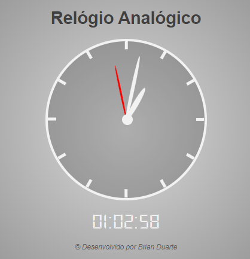

<h2> Hello World ✋! Sejam bem vindos ao meu projeto do Relógio 🕙! </h2>

Neste trabalho desenvolvido através da B7Web, tive a oportunidade de desenvolver um relógio analógico e digital. No projeto foi utilizado os recursos do Javascript para manipular elementos do Html e CSS.

O resultado final ficou muito elegante 👌 e reproduziu exatamente a proposta do estudo!

Dêêm uma olhadinha na dinâmica do projeto em funcionamento -->  Relógio 🕙
